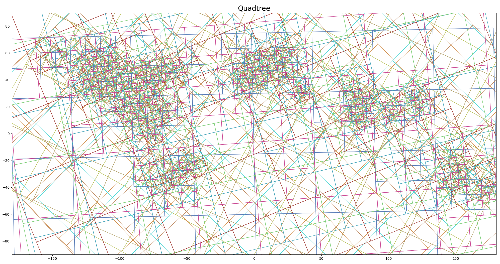

# BirdSTEM
AdaSTEM model for daily abundance estimation using eBird citizen science data

## Brief introduction
Bird STEM is an AdaSTEM model for daily abundance estimation using eBird citizen science data. It leverages the "adjacency" information of surrounding bird observation in space and time, to predict the occurence and abundance of target spatial-temporal point. In the demo, we use a two-step hurdle model as "base model", with XGBoostClassifier for occurence modeling and XGBoostRegressor for abundance modeling.

User can define the size of stixel (spatial temporal pixel) in terms of space and time. Larger stixel guarantees generalizability but loses precision in fine resolution; Smaller stixel may have better predictability in the exact area but reduced extrapolability for points outside the stixel.

In the demo, we first split the training data using temporal sliding windows with size of 50 DOY and step of 20 DOY (`temporal_start = 0`, `temporal_end=366`, `temporal_step=20`, `temporal_bin_interval = 50`). For each temporal slice, a spatial gridding is applied, where we force the stixel to be split into smaller 1/4 pieces if the edge is larger than 50 units (measured in longitude and latitude, `grid_len_lon_upper_threshold=50`, `grid_len_lat_upper_threshold=50`), and stop splitting to prevent the edge length to shrink below 10 units (`grid_len_lon_lower_threshold=10`, `grid_len_lat_lower_threshold=10`) or containing less than 50 checklists (`points_lower_threshold = 50`).

This process is excecuted 10 times (`ensemble_fold = 10`), each time with random jitter and random rotation of the gridding, generating 10 ensembles. In the prediciton phase, only spatial-temporal points with more than 7 (`min_ensemble_required = 7`) ensembles usable are predicted (otherwise, set as `np.nan`).

Fitting and prediction methods follow the convention of sklearn `estimator` class:

```py
## fit
model.fit(X_train,y_train)

## predict
pred_mean, pred_std = model.predict(X_test)
pred_mean = np.where(pred_mean>0, pred_mean, 0)
```

Where the pred_mean and pred_std are the mean and standard deviation of the predicted values across ensembles.


## Full usage:

```py
from BirdSTEM.model.AdaSTEM import AdaSTEM, AdaSTEMHurdle
from BirdSTEM.model.Hurdle import Hurdle
from xgboost import XGBClassifier, XGBRegressor

SAVE_DIR = './'

base_model = Hurdle(classifier=XGBClassifier(tree_method='hist',random_state=42, verbosity = 0, n_jobs=1),
                    regressor=XGBRegressor(tree_method='hist',random_state=42, verbosity = 0, n_jobs=1))


model = AdaSTEMHurdle(base_model=base_model,
                        ensemble_fold = 10,
                        min_ensemble_required= 7,
                        grid_len_lon_upper_threshold=50,
                            grid_len_lon_lower_threshold=10,
                            grid_len_lat_upper_threshold=50,
                            grid_len_lat_lower_threshold=10,
                            points_lower_threshold = 50,
                            temporal_start = 0, temporal_end=366, temporal_step=20, temporal_bin_interval = 50,
                            stixel_training_size_threshold = 50, ## important, should be consistent with points_lower_threshold
                            save_gridding_plot = True,
                            save_tmp = True,
                            save_dir=SAVE_DIR,
                            sample_weights_for_classifier=True)

## fit
model.fit(X_train,y_train)

## predict
pred_mean, pred_std = model.predict(X_test)
pred_mean = np.where(pred_mean>0, pred_mean, 0)
eval_metrics = AdaSTEM.eval_STEM_res('hurdle',y_test, pred_mean)
print(eval_metrics)

```


----
## Documentation:
[BirdSTEM Documentation](https://chenyangkang.github.io/BirdSTEM/)
<!-- BirdSTEM -->

----


-----
References:

1. [Fink, D., Damoulas, T., & Dave, J. (2013, June). Adaptive Spatio-Temporal Exploratory Models: Hemisphere-wide species distributions from massively crowdsourced eBird data. In Proceedings of the AAAI Conference on Artificial Intelligence (Vol. 27, No. 1, pp. 1284-1290).](https://ojs.aaai.org/index.php/AAAI/article/view/8484)

2. [Fink, D., Auer, T., Johnston, A., Ruiz‐Gutierrez, V., Hochachka, W. M., & Kelling, S. (2020). Modeling avian full annual cycle distribution and population trends with citizen science data. Ecological Applications, 30(3), e02056.](https://esajournals.onlinelibrary.wiley.com/doi/full/10.1002/eap.2056)
