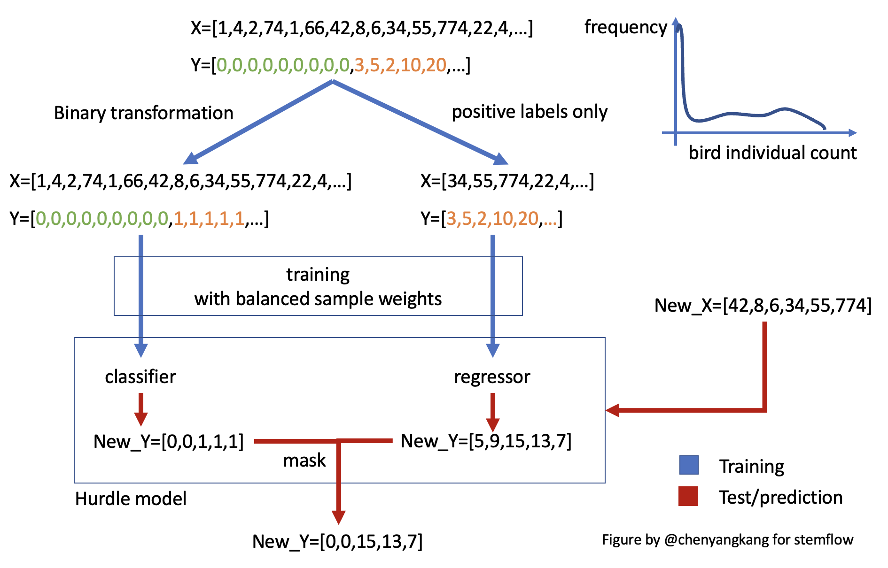

# Tips for different tasks

`stemflow` supports different types of tabular data modeling tasks, including

- Binary classification
- Regression
- Hurdle regression (first classify then regress on the positive part) for zero-inflated data


## Classification and regression

To create a classification or regression model, you can simply use the corresponding model classes.

### Binary classification

#### Create a model

For binary classification, you can pass a sklearn `BaseEstimator` style classifier (in this case `XGBClassifier`) to the AdaSTEM classifier wrapper (`AdaSTEMClassifier`):

```python
from stemflow.model.AdaSTEM import AdaSTEM, AdaSTEMClassifier
from xgboost import XGBClassifier

model = AdaSTEMClassifier(
    base_model=XGBClassifier(tree_method='hist',random_state=42, verbosity = 0,n_jobs=1),
    save_gridding_plot = True,
    ensemble_fold=10,
    min_ensemble_required=7,
    grid_len_lon_upper_threshold=1e5,
    grid_len_lon_lower_threshold=1e3,
    grid_len_lat_upper_threshold=1e5,
    grid_len_lat_lower_threshold=1e3,
    temporal_start=1,
    temporal_end=366,                            
    temporal_step=20,  
    temporal_bin_interval=50, 
    points_lower_threshold=50,             
    Spatio1='proj_lng',                   
    Spatio2='proj_lat',
    Temporal1='DOY',
    use_temporal_to_train=True,
    njobs=1
)
```

`stemflow` automatically calculates binary class weights (using `sklearn.utils.class_weight.compute_class_weight` with `class_weight` set as `'balanced'`) in each stixels for imbalanced data and pass them to base model during training.

#### Prediction

```py
## fit
model = model.fit(X_train.reset_index(drop=True), y_train)

## predict
pred = model.predict(X_test)
```

Alternatively, you can predict the probability:

```py
## get class probability
pred_proba = model.predict_proba(X_test)
```

Or return the prediction variation across the ensembles:

```py
## also return the prediction std
pred_proba_mean, pred_proba_std = model.predict_proba(X_test, return_std=True)
```


#### Evaluation

Correspondingly, you would use a set of metrics for the classification problem:
```
# Evaluation
eval_metrics = AdaSTEM.eval_STEM_res('classification',y_test, pred_mean)
```
This will return a bunch of metrics, including AUC, precision, recall, etc.


### Regression

For Regression problem, you can pass a sklearn `BaseEstimator` style regressor (in this case `XGBRegressor`) to the AdaSTEM regressor wrapper (`AdaSTEMRegressor`):

```python
from stemflow.model.AdaSTEM import AdaSTEM, AdaSTEMRegressor
from xgboost import XGBRegressor

model = AdaSTEMRegressor(
    base_model=XGBRegressor(tree_method='hist',random_state=42, verbosity = 0,n_jobs=1),
    save_gridding_plot = True,
    ensemble_fold=10,
    min_ensemble_required=7,
    grid_len_lon_upper_threshold=1e5,
    grid_len_lon_lower_threshold=1e3,
    grid_len_lat_upper_threshold=1e5,
    grid_len_lat_lower_threshold=1e3,
    temporal_start=1,
    temporal_end=366,                            
    temporal_step=20,  
    temporal_bin_interval=50, 
    points_lower_threshold=50,             
    Spatio1='proj_lng',                   
    Spatio2='proj_lat',
    Temporal1='DOY',
    use_temporal_to_train=True,
    njobs=1
)
```
Correspondingly, you would use a set of metrics for the regression problem:

```py
## fit
model = model.fit(X_train.reset_index(drop=True), y_train)

## predict
pred = model.predict(X_test)
pred = np.where(pred<0, 0, pred)

# Evaluation
eval_metrics = AdaSTEM.eval_STEM_res('regression',y_test, pred_mean)
```

Likewise, you could also return the variation of prediction by setting `return_std=True` in method `predict`. `predict_proba` is not available for regression.


## Hurdle

[Hurdle model](https://en.wikipedia.org/wiki/Hurdle_model#:~:text=A%20hurdle%20model%20is%20a,of%20the%20non%2Dzero%20values.) is different from regression or classification model – it combines them.

Hurdle model is designed to solve the [zero-inflation problems](https://en.wikipedia.org/wiki/Zero-inflated_model), which is commonly seen in **count data**, for example, the count of individual birds for a species in each checklists. Too many "zeros" in target data will bias the loss function and induce imbalanced likelihood, weaken the model performance. Similar methods to solve zero-inflation problems include Zero-Inflated Poisson Model (ZIP), Zero-Inflated Negative Binomial Model (ZINB).

### Hurdle model workflow
Hurdle model, as its name indicates, uses two-step modeling method to solve the zero-inflation problems:



As shown in this figure, zero-inflated input data was first used to train a classifier, with labels being binary transformed. Then, the samples with positive labels are used to train a regressor. Together these two compose a hurdle model. When new data comes in, classifier and regressor make prediction independently, and the results are combined/masked to yield the final prediction (only those samples classified as positive will be assigned continuous prediction from the regressor).

### Hurdle model common practice
Combined with AdaSTEM framework, hurdle model is usually used as a based model:

```python
model = AdaSTEMRegressor(
    base_model=Hurdle(
        classifier=XGBClassifier(...),
        regressor=XGBRegressor(...)
    ),  
    ...
)
```

This is a common practice in most paper I've seen, including reference [1-3].

However, AdaSTEM model could also be used as regressor or classifier is needed:

```python
model_Ada_in_Hurdle = Hurdle_for_AdaSTEM(
    classifier=AdaSTEMClassifier(
        base_model=XGBClassifier(...),
        ...),
    regressor=AdaSTEMRegressor(
        base_model=XGBRegressor(...),
        ...)
)

```

The later one is more a conservative framework and have higher `precision` score, but lower recall and overall performance. For more details see "[Hurdle in AdaSTEM or AdaSTEM in hurdle?](https://chenyangkang.github.io/stemflow/Examples/05.Hurdle_in_ada_or_ada_in_hurdle.html)"


-----
References:

1. [Fink, D., Damoulas, T., & Dave, J. (2013, June). Adaptive Spatio-Temporal Exploratory Models: Hemisphere-wide species distributions from massively crowdsourced eBird data. In Proceedings of the AAAI Conference on Artificial Intelligence (Vol. 27, No. 1, pp. 1284-1290).](https://ojs.aaai.org/index.php/AAAI/article/view/8484)

1. [Fink, D., Auer, T., Johnston, A., Ruiz‐Gutierrez, V., Hochachka, W. M., & Kelling, S. (2020). Modeling avian full annual cycle distribution and population trends with citizen science data. Ecological Applications, 30(3), e02056.](https://esajournals.onlinelibrary.wiley.com/doi/full/10.1002/eap.2056)

1. [Johnston, A., Fink, D., Reynolds, M. D., Hochachka, W. M., Sullivan, B. L., Bruns, N. E., ... & Kelling, S. (2015). Abundance models improve spatial and temporal prioritization of conservation resources. Ecological Applications, 25(7), 1749-1756.](https://esajournals.onlinelibrary.wiley.com/doi/full/10.1890/14-1826.1)
